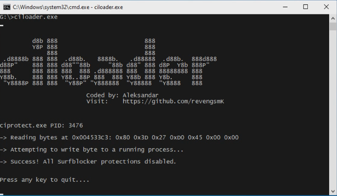

## ciLoader

A [Blumentals Surfblocker](https://www.surfblocker.com/) v5.x protection bypass implemented as a memory loader.

### Screenshot & demo

 

https://user-images.githubusercontent.com/95986479/147161139-4cd112db-8741-44fe-b768-abb05d7d8a97.mp4

### Overview

_ciprotect.exe_ is a Surfblocker command line configuration utility. It is located in the Surfblocker installation directory, and it communicates with IProtectorService to perform protection.   

In order to set configuration using ciprotect.exe, you need to specify _-pass_ flag and a valid password.   

Operation of **ciLoader** is simple. It creates suspended ciprotect.exe instance, then patches it in memory, allowing you to disable all Surfblocker protections, without the need to supply valid password.

### Usage

Copy **ciloader.exe** in the same directory where _ciprotect.exe_ is located and run it. It doesn't have to be in the default installation directory ( e.g. C:\Program Files\Surfblocker ),since you wouldn't be able to copy loader in that location without administrative privileges.  

### How to build

Install either GCC or MSVC compiler and set PATH environment variable correctly to point to your chosen compiler, then run **build.bat** script. The script prefers GCC, but if it is not available it will try to build using MSVC.

This loader is intended to be compiled as a 32-bit binary, so make sure you have set your compiler to output 32-bit image.

### Affected versions

Following Surfblocker versions are affected:
 
**5.8, 5.9, 5.10, 5.11, 5.12**

because identical ciprotect.exe file is supplied.

### Note on antivirus

Your antivirus software may flag this loader as a malware or potentially unwanted program (PUP).   
Please ignore this, and add it to your antivirus exclusion list.

### Support

[](bitcoin:bc1qjwedefp3xruv7qak72l89hzx5mx0c0ftq8qem7)

If you would like to see more projects like this one, please consider supporting me :)  

Donate bitcoin to the following address:


```
bc1qjwedefp3xruv7qak72l89hzx5mx0c0ftq8qem7
```
